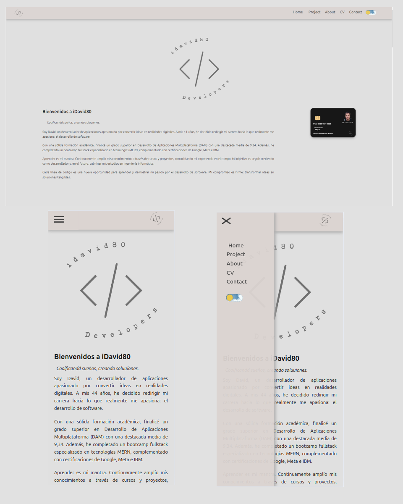
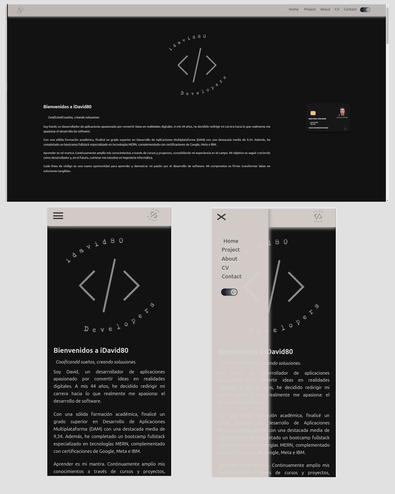

# 🖥️ Personal Portfolio

Este repositorio contiene el código fuente de mi portafolio personal, desarrollado con **React** y configurado con **Vite** para un desarrollo rápido y eficiente. La aplicación está diseñada para mostrar mis proyectos, experiencia y habilidades de forma atractiva y funcional.  

## 📂 Estructura del Proyecto

La estructura del proyecto sigue una arquitectura modular para mantener el código organizado y escalable. A continuación, se describe la disposición de los principales componentes y páginas:

```bash
src/
│
├── App.css                 # Estilos generales de la aplicación.
├── App.jsx                 # Punto de entrada principal.
├── assets/images                  # Contiene los recursos de la aplicación.
│           └── framewors/
│           └── icons/
├── hooks/
│   ├── isMobile.js         # Hook personalizado para detectar dispositivos móviles.
│   └── viewMode.js         # Hook para manejar el modo oscuro/claro.
│
├── pages/                  # Contiene las páginas principales de la aplicación.
│   ├── AboutMe.jsx         # Página "Sobre Mí".
│   ├── Curriculum.jsx      # Página con detalles del currículum.
│   ├── Footer.jsx          # Componente Footer con Redes sociales
│   ├── Home.jsx            # Página de inicio.
│   ├── Projects.jsx        # Página de proyectos.
│   └── components/
│       └── aboutMe/
│           ├── FrameworCard.jsx     
│           └── InfoSkills.jsx     
│           ├── Modal.jsx     
│           └── SkillBar.jsx  
│       └── curriculum/
│           ├── BackOrFrontToogle.jsx     # Toggle para detectar tarjeta frontend o backend.
│           └── CardExperience.jsx     # Tarjeta giratoria con experiencia frontend o backend..
│           ├── StackRotation.jsx     # Paginación de la tarjeta giratoria.
│       └── footer/
│           ├── Loanding.jsx     # Componente de carga bolas .
│           └── SocialCard.jsx     # Componente Redes sociales.
│           ├── Tooltips.jsx     # Componente iconos Redes sociales.
│       └── home/ # Eliminar
│           ├── CreditCard.jsx     # Componente de carnet developer.
│       └── nav/
│           ├── Nav.jsx     # Componente de navegación.
│           └── Nav.css     # Estilos del componente de navegación.
│       └── project/
│           ├── Carrussell.jsx     # Componente de proyectos.
│           └── IconLinks.jsx     # Links con iconos relacionados con el proyecto
│           └── ProjectCard.jsx     # Tarjeta por proyectos
│
└── index.css               # Estilos globales.

```


## 🌟 Funcionalidades Principales

### 1. **Navegación Intuitiva**
El componente `Nav` permite navegar fácilmente entre las diferentes secciones del portafolio: inicio, proyectos, sobre mí, currículum y footer.

### 2. **Modo Oscuro y Claro**
El hook personalizado `viewMode` controla el estado del tema (oscuro o claro) en toda la aplicación.  
El cambio de tema se realiza mediante un botón que alterna entre ambos modos.

```javascript
const [darkMode, setDarkMode] = viewMode(); 

const toggleTheme = () => {
  setDarkMode(!darkMode);
};

```

### 3. Componentes Modularizados  
Cada página (`Home`, `Projects`, `AboutMe`, `Curriculum`) está separada en su propio archivo para facilitar la reutilización y el mantenimiento del código.

### 4. Responsive Design  
La aplicación detecta si el dispositivo es móvil mediante el hook `isMobile` y ajusta la experiencia de usuario en consecuencia.

### 5. Vite como Herramienta de Desarrollo  
- Arranque rápido del proyecto.  
- Actualización en caliente (HMR) para una experiencia de desarrollo ágil.  
- Construcción optimizada para producción.  

---

## 🛠️ Cómo Ejecutar el Proyecto  

1. Clona este repositorio:


> git clone https://github.com/tu-usuario/portfolio-react-vite.git
> cd portfolio-react-vite

2. Inicia el servidor de desarrollo:

> npm run dev

3. Accede al portafolio en tu navegador en http://localhost:5173.

## 🌐 Tecnologías Usadas  

- **React**: Biblioteca para construir la interfaz de usuario.  
- **Vite**: Herramienta de desarrollo para un rendimiento mejorado.  
- **CSS**: Estilizado del portafolio.  
- **Hooks personalizados**: Gestión del estado y funcionalidades específicas.  

---

## ✨ Capturas de Pantalla  

### 💻 Modo Claro  


### 🌙 Modo Oscuro  


---

## 📄 Licencia  

Este proyecto está bajo la [MIT License](LICENSE). Siéntete libre de usarlo, modificarlo o contribuir a él.  
